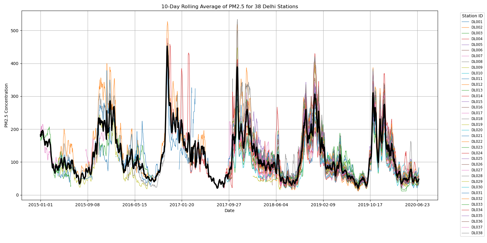

# Saans

This song explores Data Sonification through **timbre** — the quality of a sound, mathematically described as the shape of the sound wave.

The data comes from a [Kaggle Dataset](<https://www.kaggle.com/datasets/rohanrao/air-quality-data-in-india?select=city_day.csv>) of AQI sensors spread out across Delhi, the capital of India. Delhi has experienced a growing pollution crisis over the last several years, with especially dangerous outbreaks virtually every October and November, due to a unique confluence of cold air trapping city pollution, and illegal yet commonly-practiced stubble burning from upwind farmers quickly rotating their crops. *Saans* is the Hindi word for breath. 

The cyclical nature of these pollution cycles lends itself well to Indian Classical music. This composition is in the Hindustani style, which has developed over hundreds of years in northern India where Delhi is located, and is derived from more ancient Indian musical traditions that are believed to be thousands of years old. The core component of Hindustani classical music is the drone, which holds the *Shadja* (root) and *Pancham* (fifth) for the entire composition. Here's where the Data Sonification comes in — using detuned waves, LFOs, and simple volume mixing, I create an effect where the drone is "cleaner" when the air is cleaner, and “dirtier” when the air is more polluted. 

This composition is written in Raga Bhairavi, partially due to its mysterious and unsettling mood (it shares the same discrete pitches as the Phrygian Mode), and partially as an homage to Brown Bhairavi, the student group that has likely had the greatest influence on my development as a musician during my time at Brown. Two fellow musicians from Brown Bhairavi, Shiv Prasad ‘27 on violin and Aman Singh ‘26 on tabla, joined me on clarinet in this piece. 

I structure this composition just like any Hindustani composition:
- Alaaps (improvisatory sections) by Shiv and I
- Bandish (a tune I wrote) by everyone
- Improvisation by Shiv then myself
- Bandish again

I also created an animation of the station data, and combined the audio and video. You can watch that in "saans_combinedAudioVideo.mp4."

