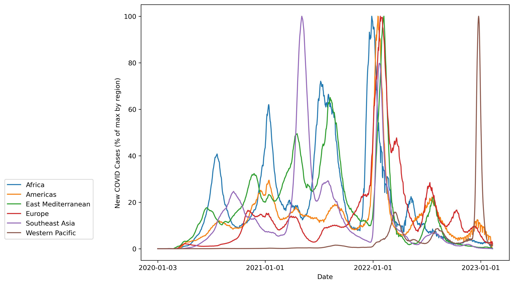

# Sirens

This song explores Data Sonification through **pitch** — how high or low a note is.

The story of this composition begins during my sophomore year, when I attended a round-table conversation sponsored by the Data Science Institute, led by data journalist and Pulitzer-recipient Mona Chalabi. She mentioned a project that she had been inspired by, where a data scientist had taken income levels at stations along one line of the NYC Subway, and created a simple sine wave that grew higher and lower as incomes increased and decreased. What was striking was that listeners could hear and interpret the data based on their own personal experiences, i.e. they could name specific neighborhoods while listening to the audio based on their reputation for high or low incomes. The idea immediately caught by imagination, and my mind turned to what data sources I could apply this to. As I was wearing a mask at the time, my mind naturally turned to the COVID-19 Pandemic, for which data is publicly available from the World Health Organization. 

A Data Visualization like this is great for getting information. But how does it make you feel? To me, it feels devoid of context or emotion. Even if I added captions to different segments, for example labeling the Delta Wave in the middle of 2021 and the Omicron Wave at the start of 2022, it might feel like something you look at for a few seconds, and scroll past. 

Data Sonification, to me, is a more viable method to give data more emotions, and tell stories through data. I set each wave above to sawtooth glissandos from the notes G3 to G6, wrote a piano and snare drum accompaniment, and added some news clips and other sound effects to guide the listener through the narrative. This leads to some interesting discoveries; for example, the vaccine was widely available and distributed throughout 2021 (when I got my two doses), and yet vaccine conspiracy theories took hold in many parts of the United States and prevented herd immunity, just before the Omicron Wave.

The code for this piece can be found in a different repository: 
[https://github.com/ayushman-choudhury/sirens](https://github.com/ayushman-choudhury/sirens)