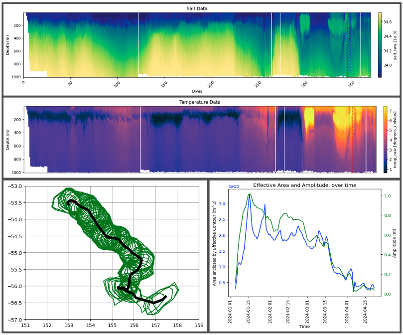

# Turbulence

Check out the .wav output [here](https://drive.google.com/drive/folders/1Y7xn2D2IrMf8XWSyzj26Gw350WG4PYGT?usp=sharing).

---

For the last piece of my music thesis concert, I turned to my other thesis — Applied Mathematics. I am working with Professor Mara Freilich and Dr. Lily Dove to combine two perspectives on eddies in the Southern Ocean: surface-visible properties from satellites, and subsurface properties from underwater gliders and floats.

I exported a small amount of data, focusing on one eddy, and constructed two drones:

1. The first drone is in E (the "dominant"), and follows the underwater glider as it approaches the eddy. I use the salinity to change the timbre (saltier water has more sawtooth, and fresher water has more sine), and the temperature to change the volume (warmer water is louder, colder water is softer). The lower frequencies are controlled by these levels at 800 meters, and the higher frequencies are controlled by these levels at 150 meters.

2. The second drone is in A (the "tonic"), and follows the satellite observations of this eddy. I use the Sea Surface Height amplitude of the eddy to change the volume of the drone, and the speed of the water circling around the eddy to change the panning oscillation, so it sounds like the drone is rotating around the listener like the eddy.

During the concert, I projected the graphs on screen, and improvised on piano as this was playing, following the graphs. I chose to have the second drone in A, so that I could end the same way the concert began — open 5ths tuning, finally settling on A. 
